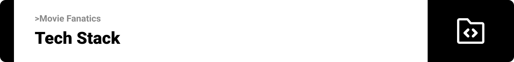

<div align="center">

> Hello world! This is the project’s summary that describes the project plain and simple, limited to the space available. 

  
**[PROJECT PHILOSOPHY](#project-philosophy) • [WIREFRAMES](#wireframes) • [TECH STACK](#tech-stack) • [IMPLEMENTATION](#implementation) • [HOW TO RUN?](#how-to-run)**

</div>

<br><br>


> BuildMe is a website for NFTs minters and owner, our philosophy is to help the user build a modern website to showcase and sell their NFTs.<br/>

### Normal user Stories
- As a user, I can check projects rodmaps.
- As a user, I can check projects teams.
- As a user, I cancheck NFTs prices.


### Admin user Stories
- As an admin, I can check registered users.
- As an admin, I can track users and delete or edit any website.

<br><br>


> This design was planned before on paper, then moved to Figma app for the fine details.
Note that i didn't use any styling library or theme, all from scratch and using pure css modules

| Home  | About  |
| -----------------| -----|
|  |  |

|Team | Roadmap  |
| -----------------| -----|
|  |  |


<br><br>



Here's a brief high-level overview of the tech stack the Well app uses:

- This project uses the [React Library](www.reactjs.org). React is a free and open-source front-end JavaScript library for building user interfaces based on UI components.

- The server side of the project is build using the [Node.js environment](https://nodejs.org/en/) and the [Express Framework](https://expressjs.com/).

- For database, the app uses the [MongoDB database](https://www.mongodb.com/). MongoDB is a source-available cross-platform document-oriented database program.

- For animations, the app uses the [GSAP framework](https://greensock.com/). GSAP is the most robust high-performance JavaScript animation library on the planet.


<br><br>


Using the above mentioned tech stacks and the wireframes build with figma from the user sotries we have, the implementation of the app is shown as below, these are screenshots from the real app

| Home  | About  |
| -----------------| -----|
|  | 

| Showcase | Team  |
| -----------------| -----|
|  | 

| Roadmap | Faq  |
| -----------------| -----|
|  | 

| footer | login  |
| -----------------| -----|
|  | 

| Connect Metamask | Home Builder |
| -----------------| -----|
|  | 

| FAQ Builder | About Builder |
| -----------------| -----|
|  | 

| Roadmap Builder | NFTs Uploader |
| -----------------| -----|
|  | 

<br><br>


> This is an example of how you may give instructions on setting up your project locally.
To get a local copy up and running follow these simple example steps.

### Prerequisites

This is an example of how to list things you need to use the software and how to install them.
* npm
  ```sh
  npm install npm@latest -g
  ```

### Installation

_Below is an example of how you can instruct your audience on installing and setting up your app. This template doesn't rely on any external dependencies or services._

1. Clone the repo
   ```sh
   git clone https://github.com/Nadim-Nahle/Movies-Fanatics.git
   ```
2. Open `backend-Node` folder

3. Install NPM packages
   ```sh
   npm install
   ```
   ```
4. run `npm start` to run the backend
   ```sh
   npm start';
   ```
   ```
5. Open `frontend-react` folder

6. Install NPM packages
   ```sh
   npm install
   ```
   ```
7. run `npm start` to run the frontend
   ```sh
   npm start';
   ```
   ```
8. Enjoy the project!
   

